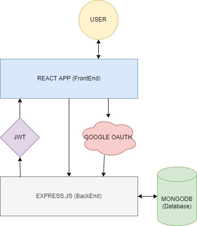

# SKILL TEST APP

## Fullsatck JS
### Build with MongoDB Express.JS React.JS and Node.JS (MERN)

## Feature
### Login with Email and Password and login with google OAuth2.0.

## Library and Apps
- MongoDB
- Express.js
- React.js
- Node.js
- bcryptjs
- React Google Login
- React router dom
- Eslint

## Run Steps
1. change directory to server and type "npm run start" in terminal.
2. change directory to client and type "npm run start" in terminal.

## Diagram

Bismillahirrohmanirrohim LULUS!